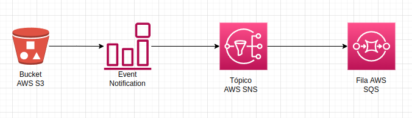

# s3-event-notification

O s3-event-notification é uma demonstração de como capturar eventos do bucket S3 e deixá-los acessíveis
através de uma fila no AWS SQS para que aplicação consuma esses eventos e atenda uma  necessidade de negócio. 
Está sendo usado o Terraform para provisionar os recursos necessários para esse exemplo na conta AWS.

## Arquitetura



### Descrição da arquitetura

1. Os eventos(PutObject, GetObject, DeleteObject e etc) realizado no bucket AWS S3 são monitorados
pelo Event Notification.

2. Event Notification envia os eventos para o tópico AWS SNS. Outros destinos podem
ser configurado como AWS Lambda, AWS SQS. Para mais detalhes veja: [Using Amazon SQS, Amazon SNS, and Lambda](https://docs.aws.amazon.com/AmazonS3/latest/userguide/how-to-enable-disable-notification-intro.html)

3. Os eventos do tópico são enviados para a fila AWS SQS. Acessando a fila SQS, através do console da AWS, é possível visualizar o formato do log de evento.

## Pré Requisitos
- [Conta AWS](https://comunidadecloud.com/como-criar-uma-conta-na-aws/).
- [Instalação e configuração do AWS CLI](https://www.treinaweb.com.br/blog/como-instalar-e-configurar-o-aws-cli)
- [Instalação e configuração do Terraform](https://developer.hashicorp.com/terraform/tutorials/aws-get-started/install-cli)

## Instruções para provisionar a infra e as configurações


```
# Comando para inicializar o terraform na máquina local
$ terraform init

# Comando para ver o plano que execução do recurso que será provisionado na AWS 
$ terraform plan

# Comando criar os recursos na conta AWS
$ terraform apply

```

Ao executar os comandos acima, serão criados os recursos que foram definidos no arquivo main.tf

## Exemplo de formato de eventos enviado para a fila SQS

Evento gerado ao criar o path 'anomesdia=20221226' no bucket
<details>
    <summary>Clique aqui para expandir!</summary>
    
    {
        "Records": [
            {
              "eventVersion": "2.1",
              "eventSource": "aws:s3",
              "awsRegion": "sa-east-1",
              "eventTime": "2022-12-28T03:32:27.633Z",
              "eventName": "ObjectCreated:Put",
              "userIdentity": {
                "principalId": "AWS:ADDDSDFFDGFGFFH"
              },
              "requestParameters": {
                "sourceIPAddress": "111.100.74.44"
              },
              "responseElements": {
                "x-amz-request-id": "6FAY439H9R3BTYTYT",
                "x-amz-id-2": "cV4U+MxWe7oXk5T3Fezj/28EiYRZY8eFAE1gRloXW9zqJfMiO3Dmq/+l9wt2juqtHQ88AkYnDas6JW1JEKWbvtgfgffyYYuuy="
              },
              "s3": {
                "s3SchemaVersion": "1.0",
                "configurationId": "tf-s3-topic-20221228021054364000000001",
                "bucket": {
                  "name": "my-bucket-test-notification-15422122322334",
                  "ownerIdentity": {
                    "principalId": "A2ZUQ5XE7SF0W0"
                  },
                  "arn": "arn:aws:s3:::my-bucket-test-notification-15422122322334"
                },
                "object": {
                  "key": "analytics_table_teste/anomesdia%3D20221226/",
                  "size": 0,
                  "eTag": "d41d8cd98f00b204e9800998ecf8427e",
                  "sequencer": "0063ABB8CB94C820C7"
                }
              }
            }
        ]
    }
    

</details>

Evento gerado ao fazer upload do arquivo 'test.log' no path 'analytics_table_teste/anomesdia=20221226' do bucket
<details>
    <summary>Clique aqui para expandir!</summary>
    
    {  
    
      "Records": [
        {
          "eventVersion": "2.1",
          "eventSource": "aws:s3",
          "awsRegion": "sa-east-1",
          "eventTime": "2022-12-28T02:56:09.224Z",
          "eventName": "ObjectCreated:Put",
          "userIdentity": {
            "principalId": "AWS:ADDDSDFFDGFGFFH"
          },
          "requestParameters": {
            "sourceIPAddress": "170.150.74.44"
          },
          "responseElements": {
            "x-amz-request-id": "S5W8W8Y5XM4Z9869",
            "x-amz-id-2": "IQY/x6GFPxbrfuq3+PRsdcj1doPPv0txJO/HSPdQTPL4aBUFX+OhmnEycaxyFe3Iqa6vfTY30JqQz66lMN33zUArVtfuXIpD4ry"
          },
          "s3": {
            "s3SchemaVersion": "1.0",
            "configurationId": "tf-s3-topic-20221228021054364000000001",
            "bucket": {
              "name": "my-bucket-test-notification-15422122322334",
              "ownerIdentity": {
                "principalId": "A2ZUQ5XE7SF0W0"
              },
              "arn": "arn:aws:s3:::my-bucket-test-notification-15422122322334"
            },
            "object": {
              "key": "analytics_table_teste/anomesdia%3D20221226/test.log",
              "size": 34,
              "eTag": "e827b73c5d30e5388e2cc8e492c758c8",
              "sequencer": "0063ABB049326BCD9C"
            }
          }
        }
      ]
    }
    

</details>

## Destrua os recursos criados nesse exemplo para não gerar custos na conta AWS

```
$ terraform destroy
```


    


